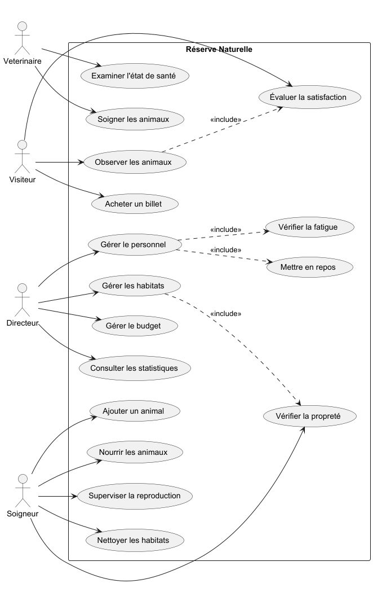
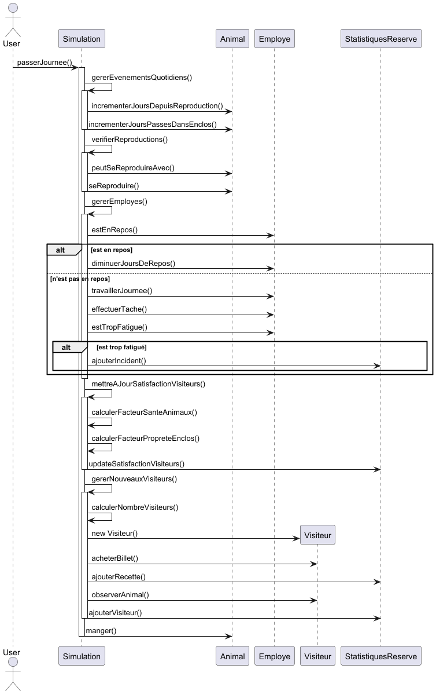
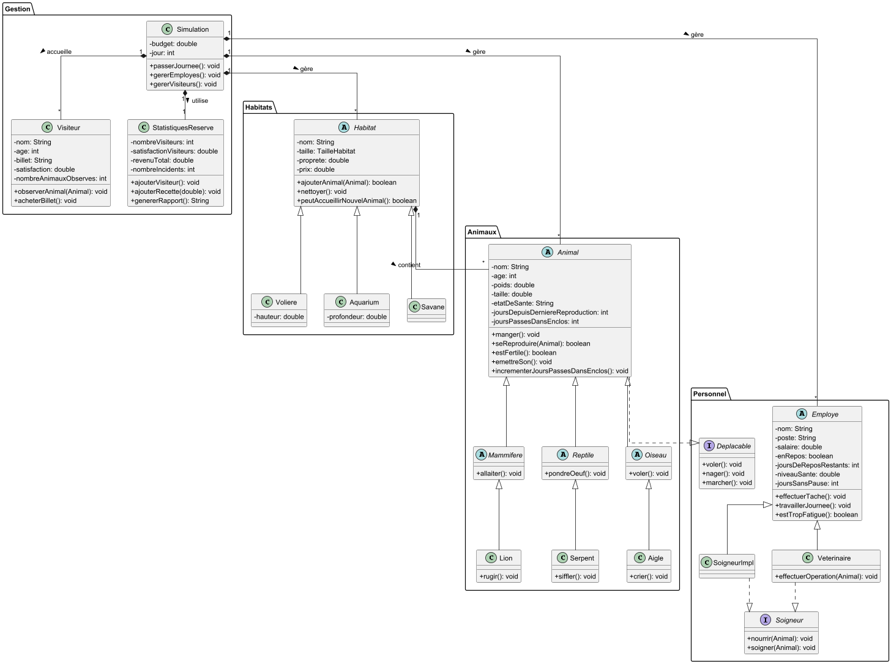
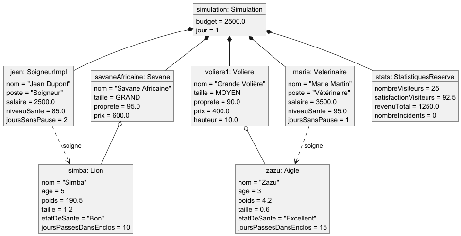

# 🦁 Réserve Naturelle - Système de Gestion

Application de gestion d'une réserve naturelle développée en Java avec JavaFX, permettant la gestion des animaux, des habitats, du personnel et des visiteurs.

## 📝 Description
Cette application permet de gérer une réserve naturelle de manière complète avec un suivi des animaux, des soins, des habitats, du personnel et des visiteurs. Elle inclut également un système de simulation temporelle et de statistiques.

## 📁 Structure du projet
Le projet suit une architecture orientée objet avec les packages suivants :
```
com.example.evaluation_wallois_arthur/
├── models/
│   ├── animaux/
│   │   ├── Lion.java
│   │   ├── Aigle.java
│   │   ├── Serpent.java
│   │   ├── Mammifere.java
│   │   ├── Oiseau.java
│   │   └── Reptile.java
│   ├── employes/
│   │   ├── Employe.java
│   │   ├── SoigneurImpl.java
│   │   └── Veterinaire.java
│   ├── habitats/
│   │   ├── Habitat.java
│   │   ├── Savane.java
│   │   ├── Voliere.java
│   │   └── Aquarium.java
│   └── Animal.java
├── controllers/
│   └── MainController.java
├── interfaces/
│   ├── Soigneur.java
│   └── Deplacable.java
├── simulation/
│   └── Simulation.java
└── utils/
    └── SaveManager.java
```

## 🦊 Types d'Animaux
- **Lion**: Mammifère prédateur
  - Capacité spéciale : Rugissement
- **Aigle**: Oiseau de proie
  - Capacité spéciale : Vol
- **Serpent**: Reptile
  - Capacité spéciale : Nage

## 🏗️ Types d'Habitats
- **Savane**: Pour les mammifères terrestres
- **Volière**: Pour les oiseaux
- **Aquarium**: Pour les reptiles aquatiques

## 👥 Personnel
- **Soigneur**: S'occupe des soins quotidiens
  - Nourrir les animaux
  - Nettoyer les habitats
- **Vétérinaire**: Gère la santé des animaux
  - Examens médicaux
  - Opérations spéciales

## ⭐ Fonctionnalités
- Gestion complète des animaux (ajout, suivi, reproduction)
- Gestion des habitats (création, nettoyage, surveillance)
- Gestion du personnel (embauche, repos, fatigue)
- Système de visiteurs avec satisfaction
- Statistiques détaillées
- Système de sauvegarde/chargement
- Simulation temporelle jour par jour

## 💼 Gestion du Personnel
- Système de fatigue
- Gestion des repos
- Suivi des tâches
- Surveillance de la santé

## 📊 Système de Statistiques
- Nombre de visiteurs
- Satisfaction des visiteurs
- Revenus de la billetterie
- Suivi des incidents
- Naissances d'animaux

## 🔧 Architecture technique
L'application utilise plusieurs patterns de conception :
- **MVC**: Pour la structure générale
- **Observer**: Pour les mises à jour d'interface
- **Factory**: Pour la création d'objets
- **Singleton**: Pour la gestion de la simulation

### Système de Sauvegarde
- Format JSON pour les données
- Sauvegarde complète de l'état
- Chargement automatique

## 🛠️ Dépendances requises
- Java 17
- JavaFX 17
- Jackson pour la sérialisation JSON
- Maven pour la gestion du projet

## 📈 Diagrammes

### Diagramme de cas d'utilisation


### Diagramme de séquence


### Diagramme de classes


### Diagramme d'objets



 